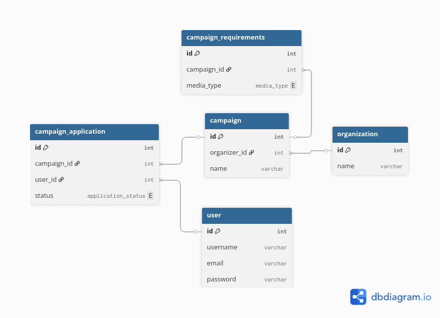

# Multi-Database Campaign Management System

This is a simplify version of a influencer campaign management system. This system store a list of users acting as influencer, organizations that wants to do influencer marketing. The organizations will have different campaigns running under their name. A campaign can specify a number of picture and video required. Influencers can apply to campaigns.

This is the database schema for the tables:



Each of these data will be displayed in a table in the front end, the user can add a new row or edit the current row.

On top of the tables will be a drop down to select the database to view from.

## Running Start with Docker

### Prerequisites
- Docker
- Docker Compose

### Running the Application

1. **Clone the repository**
   ```bash
   git clone <repository-url>
   cd db_asm_3
   ```

2. **Start all services**
   ```bash
   docker-compose up --build
   ```

3. **Access the application**
   - **Frontend**: http://localhost:5173
   - **Backend API**: http://localhost:8000
   - **API Documentation**: http://localhost:8000/docs


### Data Persistence

- **PostgreSQL**: Data persisted in `pgdata` volume
- **DuckDB**: Database file persisted in `duckdbdata` volume
- **ScyllaDB**: Data persisted in `scylladata` volume

### Stopping the Application

```bash
# Stop services
docker-compose down
```


---

**Tech Stack**: FastAPI • Vue 3 • TypeScript • PostgreSQL • DuckDB • ScyllaDB • Docker